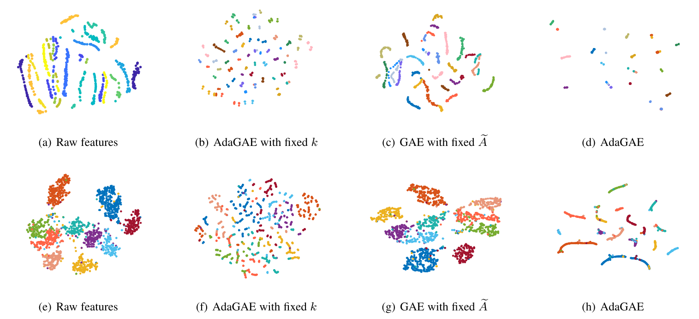

# Adaptive Graph Auto-Encoder for General Data Clustering


This repository is our implementation of 

[Xuelong Li, Hongyuan Zhang, and Rui Zhang, "Adaptive Graph Auto-Encoder for General Data Clustering," *IEEE Transactions on Pattern Analysis and Machine Intelligence*, 2021](https://ieeexplore.ieee.org/document/9606581).


The core idea of AdaGAE is to **use GNN to improve graph-based clustering methods on the general data**. The performance bottleneck is the **collapse caused by the simple update of constructed graph**, which is formally proved in the paper and shown in the following figure. The first line is the illustration of UMIST and the second line is the one of USPS. Clearly, **similar points are aggregated properly**.




**Remark:** The general data is defined as the data point only represented by an *d*-dimension vector. Unlike vision-data and text-data, the general data does not require the order of features. It also needs no prior relations of features or samples/nodes (*i.e.*, links), like graph data. **Overall, we attempt to design models that can be applied to various types of data**.


If you have issues, please email:

hyzhang98@gmail.com or hyzhang98@mail.nwpu.edu.cn.

## How to Run AdaGAE
```
python run.py
```
### Requirements 
pytorch 1.3.1

scipy 1.3.1

scikit-learn 0.21.3

numpy 1.16.5

## Citation

```
@article{AdaGAE,
  author={Li, Xuelong and Zhang, Hongyuan and Zhang, Rui},
  journal={IEEE Transactions on Pattern Analysis and Machine Intelligence}, 
  title={Adaptive Graph Auto-Encoder for General Data Clustering}, 
  year={2021},
  volume={},
  number={},
  pages={1-1},
  doi={10.1109/TPAMI.2021.3125687}
}

```

